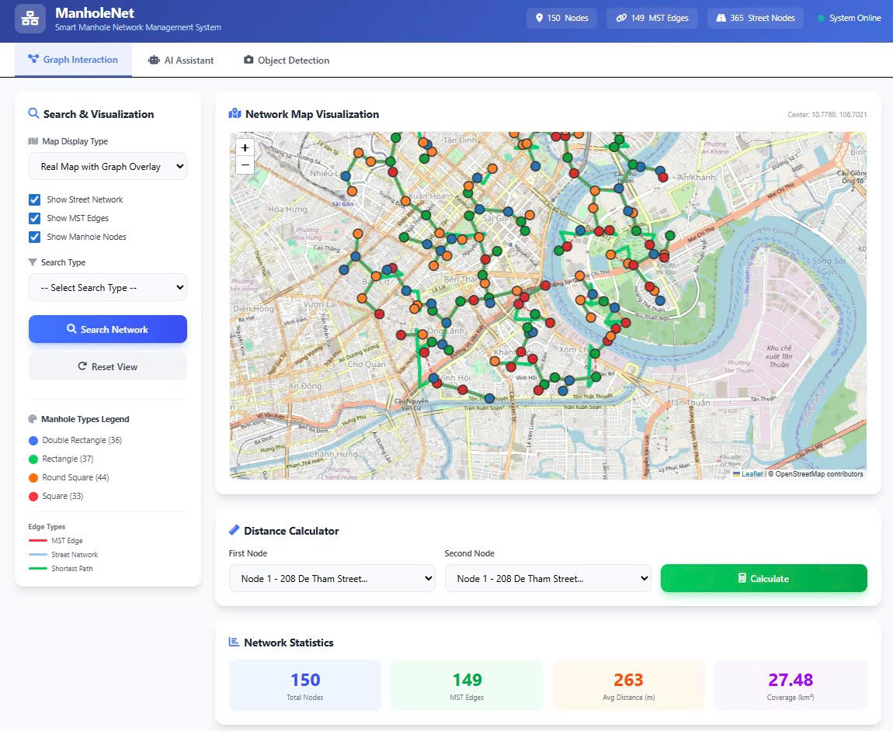

# Road-Aligned Manhole Network Reconstruction from Geotagged Street-Level Video for Urban Drainage

## Authors and Affiliations

**Huu-Hoa Nguyen1, Salem Benferhat2, and Thanh Ma1,***

1 College of Information and Communication Technology, Can Tho University, Can Tho City, 900000, Vietnam  
2 CRIL, CNRS-Artois University, Lens, France  

* Corresponding author: Thanh Ma  
Email: mtthanh@ctu.edu.vn

## Published Article

This work has been published in **Engineering Research Express**.

**DOI:** [10.1088/2631-8695/ae5f5c](https://doi.org/10.1088/2631-8695/ae5f5c)

## Abstract

Urban flooding in fast-growing cities, particularly in low- and middle-income countries, is often aggravated by incomplete and outdated records of urban drainage infrastructure. Timely intervention in field operations requires knowing where inlets and manholes are located and what functional types they serve. This gap in asset inventories motivates using low-cost, readily available data. Many municipalities already collect geotagged street-level video with geo-text overlays and have access to open road graphs for planning. We study a video-to-graph reconstruction problem for urban drainage that uses only these two sources as inputs. The goal is to build a road-aligned manhole network that supports search, visualization, and inspection routing. The target network is a surface-level representation of access points along streets rather than a detailed underground pipe map.

In this setting, we propose **ManholeNet**, an integrated engineering pipeline organized as a six-stage framework with two task-specific core procedures, **FrameSelect** and **GraphBuild**. The framework transforms raw videos into a structured manhole dataset and a road-aligned inspection backbone. **ManholeNet** combines convolutional manhole detection, OCR-based geo-text extraction, convolutional type classification, detector-driven representative-frame selection, and road-constrained graph construction. **FrameSelect** selects viewpoint-maximal frames from detection segments to reduce temporal redundancy without tracking. **GraphBuild** constructs a manhole graph using road-network shortest-path distances, spacing bounds, and a minimum-length admissible backbone.

We conduct a rigorous evaluation on two real-world datasets from Can Tho City, Viet Nam, and compare against strong baselines for both perception and network construction. ManholeNet raises video-level detection recall from 97.29% to 98.94% and increases the plausible-edge rate from 91.25% to 95.68%, while completing end-to-end processing in about 20 s. Ablation and sensitivity analyses show that FrameSelect reduces perception time by about a factor of seven while keeping video-level recall close to the all-frames reference, and that GraphBuild increases the plausible-edge rate over baselines.

## ManholeNet System Interface

The ManholeNet system provides a web-based interface for visualizing the reconstructed road-aligned manhole inspection network. The interface supports map-based visualization, manhole search, type-based filtering, inspection of manhole attributes, and road-aligned routing between selected manholes.

  

